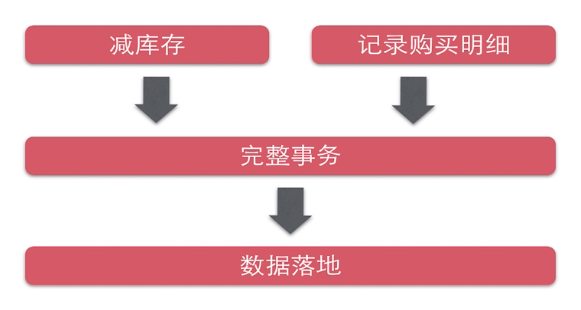
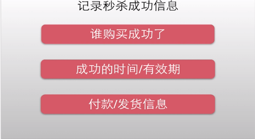
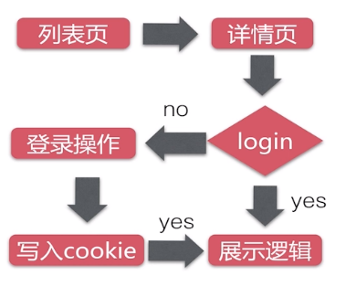
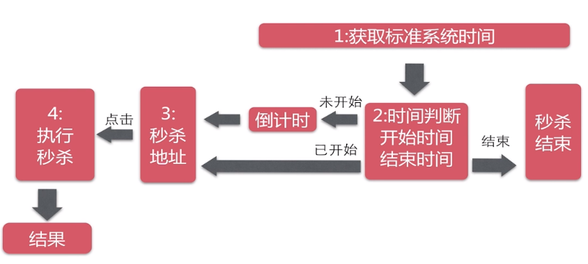
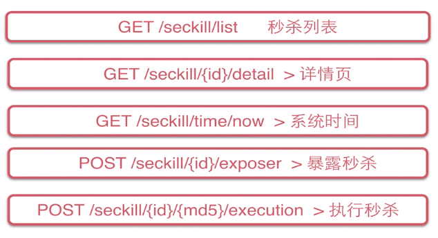
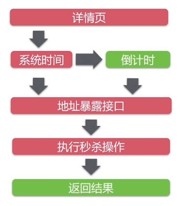
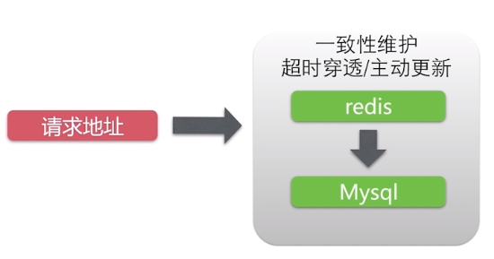

# seckill :bullettrain_front:

* [1 秒杀系统业务分析](1-秒杀系统业务分析)
* [2 开发环境](#2-开发环境)
* [3 工程创建](#3-工程创建)
* [4 业务实现](#4-业务实现)
  * [4.1 数据库建表](#4.1-数据库建表)
  * [4.2 DAO实体和接口开发](#4.2-DAO实体和接口开发)
  * [4.3 Service层开发](#4.3-Service层开发)
  * [4.4 Controller层开发](#4.4-Controller层开发)
* [5 并发优化](#5-并发优化)

-----------------------------

## 1 秒杀系统业务分析

首先分析，秒杀系统问题的本质其实是对商品库存的管理。主要业务逻辑如下图：

<div align="center"></div>

用户针对库存业务分析：

<div align="center"></div>

用户的购买行为：

<div align="center"></div>

**难点**：如何高效地处理“竞争”。

## 2 开发环境

InteliJ IDEA + Maven + Tomcat8 + JDK8

## 3 工程创建

新建一个 Maven 工程，并完善相应的目录结构。

pom 文件的依赖可以分为 4 部分：

- **日志**。使用的是 slf4j + logback 的组合。
- **数据库**。数据库连接池 + DAO框架，MyBatis依赖。
- **Servlet web**。jsp 等。
- **Spring**。主要是 Spring 相关的依赖。

全部依赖参考 [pom.xml](https://github.com/MinheZ/seckill/blob/master/pom.xml)。

## 4 业务实现

### 4.1 数据库建表

- 秒杀库存表
- 秒杀成功明细表

创建 `seckill`表时，`end_time`字段默认值为`0000-00-00 00:00:00`，报错：1067 - Invalid default value for 'end_time'。

因为在MySQL5.7之后，默认值范围必须为`1970-01-01 10:00:00`~`2037-12-31 23:59:59`。

### 4.2 DAO实体和接口开发

首先是实体类 entity 的编写，分为 [Seckill](https://github.com/MinheZ/seckill/blob/master/src/main/java/com/seckill/entity/Seckill.java) 和 [SuccessKilled](https://github.com/MinheZ/seckill/blob/master/src/main/java/com/seckill/entity/SuccessKilled.java) 。

[SeckillDao](https://github.com/MinheZ/seckill/blob/master/src/main/java/com/seckill/dao/SeckillDao.java) 和 [SuccessKilledDao](https://github.com/MinheZ/seckill/blob/master/src/main/java/com/seckill/dao/SuccessKilledDao.java) 接口为查询数据库，或者修改数据库的一些方法。

剩下的就是一些 MyBatis 整合 Spring 的配置文件编写。

启用 Junit 单元测试的时候遇到一个小插曲，如下：

```properties
jdbc.driver=com.mysql.jdbc.Driver
jdbc.url=jdbc:mysql://localhost:3306/seckill?characterEncoding=UTF-8
jdbc.username=root
jdbc.password=****
```

之前没有遵循 Driud 官方设计规范，没有添加`jdbc.`前缀，导致数据库连接异常 ERROR 1045 (28000)。

### 4.3 Service层开发

 [SeckillService](https://github.com/MinheZ/seckill/blob/master/src/main/java/com/seckill/service/SeckillService.java) 接口开发，完成秒杀业务逻辑的一些方法。

```java
List<Seckill> getSeckillList();	// 获取秒杀列表

Seckill getById(long seckillId);	// 通过 ID 获取秒杀对象

Exposer exportSeckillUrl(long seckillId);	// 判断是否需要暴露秒杀接口

// 执行秒杀操作
SeckillExecution executeSeckill(long seckillId, long userPhone, String md5)
            throws SeckillException, RepeatKillException, SeckillCloseException;
// 秒杀存储过程优化
SeckillExecution executeSeckillProcedure(long seckillId, long userPhone, String md5);
```

业务逻辑为，当秒杀开始前，秒杀页面只显示秒杀商品类型和倒计时。只有当秒杀开始的时候，才暴露秒杀地址，防止脚本提前登录。

定义一个 [Exposer](https://github.com/MinheZ/seckill/blob/master/src/main/java/com/seckill/dto/Exposer.java) 类来实现此功能。主要是通过比较系统当前时间与秒杀开始和结束的时间。

定义一个 [SeckillExecution](https://github.com/MinheZ/seckill/blob/master/src/main/java/com/seckill/dto/SeckillExecution.java) 类来封装秒杀操作之后的结果。其中用枚举类型 [SeckillStatEnum ](https://github.com/MinheZ/seckill/blob/master/src/main/java/com/seckill/enums/SeckillStatEnum.java) 封装秒杀过程之后的各种状态，例如：成功、失败等。

具体的实现类 [SeckillServiceImpl](https://github.com/MinheZ/seckill/blob/master/src/main/java/com/seckill/service/impl/SeckillServiceImpl.java) 也就是对数据库的一些增删改查，包括对秒杀接口暴露，判断秒杀状态等一些列方法的具体实现。这里要注意 `executeSeckill` 方法的事务性，该操作必须是原子的。

### 4.4 Controller层开发

首先明确 [SeckillController](https://github.com/MinheZ/seckill/blob/master/src/main/java/com/seckill/web/SeckillController.java) 业务流程：

<div align="center"></div>

详情页流程逻辑：

<div align="center"></div>

一般来说，Controller 层的 URL 表达方式默认使用 Restful 规范：

- GET -> 查询操作
- POST -> 添加/修改操作
- PUT -> 修改操作（幂等操作）
- DELETE -> 删除操作

下图为秒杀 API 的 URL 设计：

<div align="center"></div>

由于笔者是个前端菜鸡，因此页面那些东西就不在这里误人子弟了:non-potable_water:。

## 5 并发优化

在优化之前，首先弄清楚秒杀的高并发发生在哪？如下图，红色部分代表可能会有高并发区域：

<div align="center"></div>

**详情页**：参与秒杀的第一步，所有参与用户都会访问此页面。

**系统时间**：在进行当前时间与秒杀开始时间对比的过程中，由于系统访问一次内存的时间(Cacheline)非常短，大约是10ns，因此这一部分可以不做具体优化。

**地址暴露接口**：使用服务端缓存：Redis 集群。6 个 Redis 实例，3 个节点，每个节点都有自己的 slave 做备份，详细搭建过程自行 google 。

**Redis 与数据库数据一致性保证**：

<div align="center"></div>


